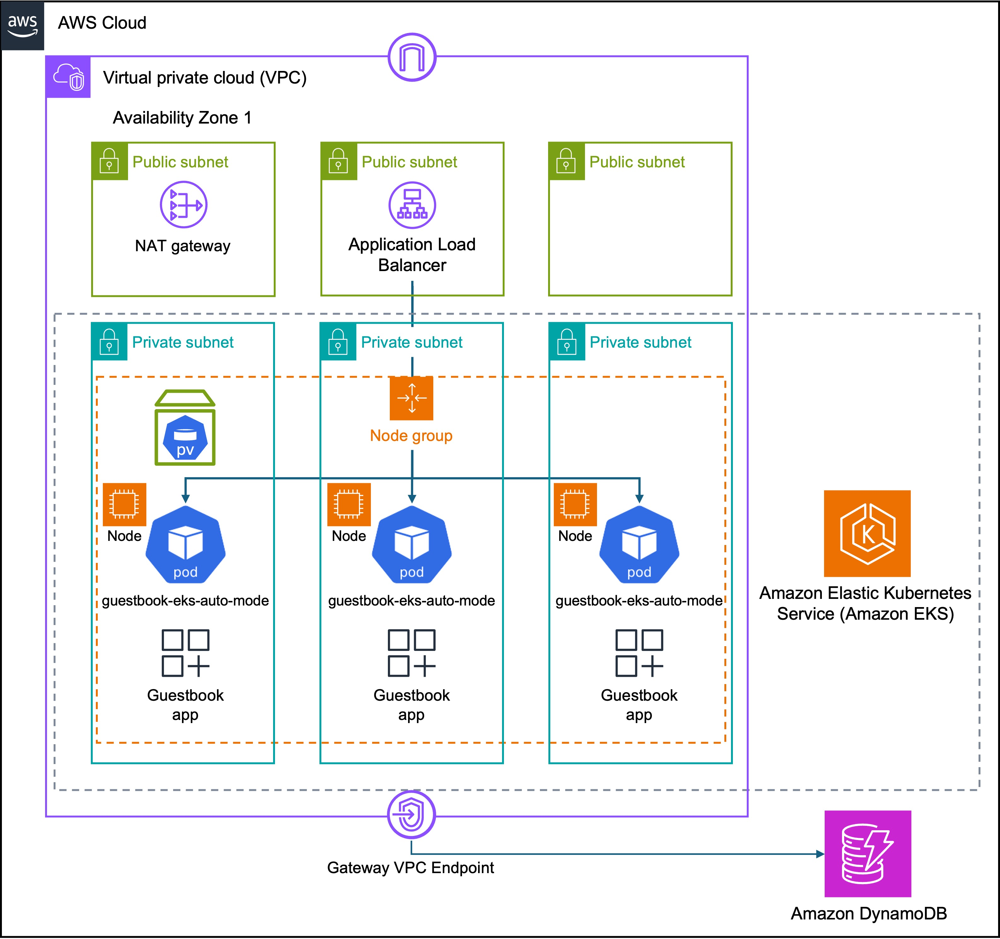

# AWS EKS Terraform demo

This repo provides the Terraform configuration to deploy a demo app running on an AWS EKS Cluster using best practices. This was created as an _educational_ tool to learn about EKS and Terraform. It is _not_ recommended that this configuration be used in production without further assessment to ensure it meets organization requirements.

## Deployed resources

This Terraform configuration deploys the following resources:
* AWS EKS Cluster using Amazon EC2 nodes
* Amazon DynamoDB table
* Amazon Elastic Block Store (EBS) volume used as attached storage for the Kubernetes cluster (a `PersistentVolume`)
* Demo "guestbook" application, deployed via containers
* Application Load Balancer (ALB) to access the app

Plus several other supporting resources, as shown in the following diagram:



## Auto Mode Disabled
This cluster does _not_ use EKS Auto Mode. To learn about EKS Auo Mode see this repo instead: https://github.com/setheliot/eks_auto_mode/

## Deploy EKS cluster and app resources

Run all commands from an environment that has
* Terraform installed
* AWS CLI installed
* AWS credentials configured for the target account

You have two options:

### Option 1. Automatic configuration and execution

1. Update the S3 bucket and DynamoDB table used for Terraform backend state here: [backend.tf](terraform/deploy/backend.tf). Instructions are in the comments in that file.
1. Choose one of the `tfvars` configuration files in the [terraform/deploy/environment](terraform/deploy/environment) directory, or create a new one. The environment name `env_name` should be unique to each `tfvars` configuration file. You can also set the AWS Region in the configuration file.
1. Run the following commands:
```bash
cd scripts

./ez_cluster_deploy.sh
```


### Option 2. For those familiar with using Terraform
1. Update the S3 bucket and DynamoDB table used for Terraform backend state here: [backend.tf](terraform/deploy/backend.tf). Instructions are in the comments in that file.
1. Create the IAM policy to be used by AWS Load Balancer Controller
    1. This only needs to be done _once_ per AWS account
    2. Create the IAM policy using the terraform in [terraform/init](terraform/init)
1. Choose one of the `tfvars` configuration files in the [terraform/deploy/environment](terraform/deploy/environment) directory, or create a new one. The environment name `env_name` should be unique to each `tfvars` configuration file. You can also set the AWS Region in the configuration file.
1. `cd` into the `terraform/deploy` directory
1. Initialize Terraform
    ```bash
    terraform init
    ```

1. Set the terraform workspace to the same value as the environment name `env_name` for the `tfvars` configuration file you are using.
   * If this is your first time running then use 
     ```bash
     terraform workspace new <env_name>
     ```
   * On subsequent uses, use
     ```bash
     terraform workspace select <env_name>
     ```
1. Generate the plan and review it
   ```bash
   terraform plan -var-file=environment/<selected tfvars file>
   ```

1. Deploy the resources
   ```bash
   terraform apply -var-file=environment/<selected tfvars file> -auto-approve
   ```

Under **Outputs** there may be a value for `alb_dns_name`. If not, then 
* you can wait a few seconds and re-run the `terraform apply` command, or
* you can look up the value in your EKS cluster by examining the `Ingress` Kubernetes resource

Use this DNS name to access the app.  Use `http://` (do _not_ use https). It may take about a minute after initial deployment for the application to start working.

If you want to experiment and make changes to the Terraform, you should be able to start at step 3.

## Tear-down (clean up) all the resources created

### Option 1. Scripted

```bash
cd scripts

./cleanup_cluster.sh \
    -var-file=environment/<selected tfvars file>
```

### Option 2. Do it yourself

```bash
terraform init
terraform workspace select <env_name>
```

```bash
terraform destroy \
    -auto-approve \
    -target=kubernetes_deployment_v1.guestbook_app_deployment \
    -var-file=environment/<selected tfvars file>

terraform destroy \
    -auto-approve \
    -target=kubernetes_persistent_volume_claim_v1.ebs_pvc \
    -var-file=environment/<selected tfvars file>

terraform destroy \
    -auto-approve \
    -target=module.alb[0].kubernetes_ingress_v1.ingress_alb \
    -var-file=environment/<selected tfvars file>

terraform destroy \
    -auto-approve \
    -var-file=environment/<selected tfvars file>
```

To understand why this requires these separate `destroy` operations, [see this](docs/cleanup.md#tear-down-clean-up-all-the-resources-created). 

## Known issues
* [Known issues](docs/known_issues.md)
---
I welcome feedback or bug reports (use GitHub issues) and Pull Requests.

[MIT License](LICENSE)